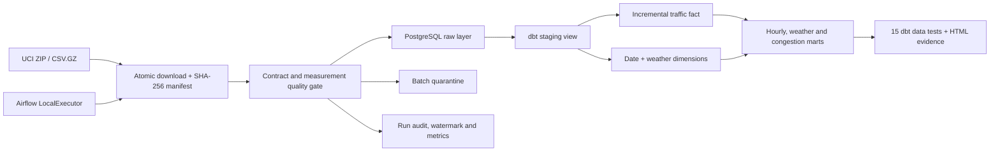
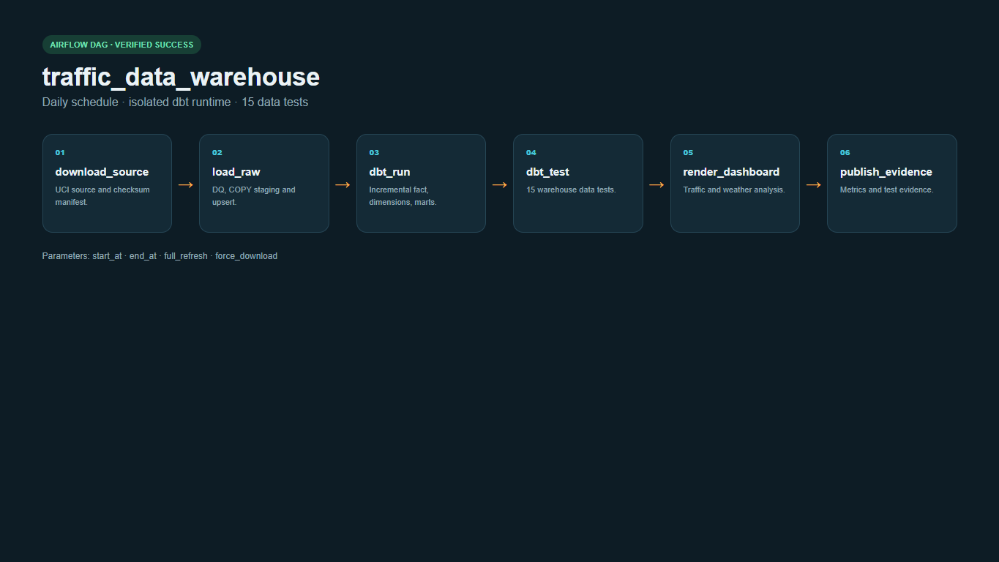
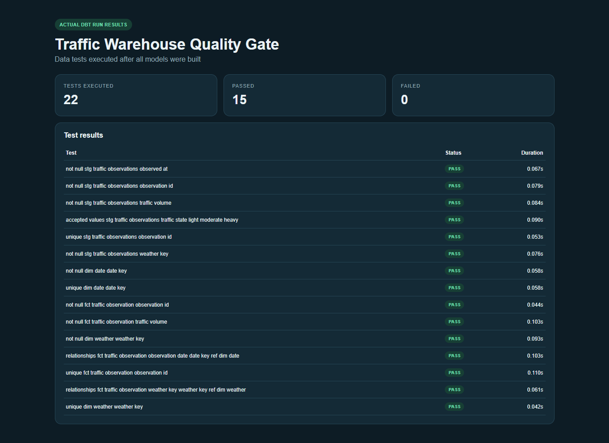

# Metro Interstate Traffic Data Warehouse

[](https://github.com/npgb2505/traffic-data-warehouse-local/actions/workflows/ci.yml)

A complete local warehouse built from the public **UCI Metro Interstate Traffic Volume** dataset. Airflow downloads and validates the source, PostgreSQL stores an idempotent raw layer, and dbt builds and tests incremental facts, dimensions, and traffic/weather marts.

> The project uses public data and Docker only. No Azure, AWS, GCP, or paid SaaS account is required.

## Verified full-data run

| Metric | Result |
|---|---:|
| Source / accepted rows | 48,204 / 48,204 |
| Rejected rows | 0 |
| Coverage | 2012-10-02 to 2018-09-30 |
| Average traffic volume | 3,260 vehicles/hour |
| Heavy-traffic observations | 43.4% |
| dbt build | 22/22 models and tests passed |
| Incremental raw lookback | 27 rows |
| Incremental dbt merge | 27 rows |
| Fact rows after rerun | 48,204 |

## Architecture



Editable source: [docs/architecture.excalidraw](docs/architecture.excalidraw)

## Production-style behavior

- Complete UCI dataset with checksum, manifest, and cached source retrieval.
- Full refresh, watermark-based hourly incremental loads, lookback, and bounded backfills.
- `COPY` into a temporary staging table followed by conflict-safe upserts.
- Quality gates for timestamps, weather fields, temperature, rain, snow, clouds, volume, rejection rate, and uniqueness.
- Incremental dbt fact table using `delete+insert`; dimensions and marts remain reproducible.
- 15 dbt tests covering uniqueness, non-null values, accepted values, and referential integrity.
- dbt runs in an isolated virtual environment so its dependencies cannot break Airflow.
- Separate Airflow metadata database, webserver, and scheduler.

## dbt models

- `staging.stg_traffic_observations`
- `analytics.dim_date`
- `analytics.dim_weather`
- `analytics.fct_traffic_observation`
- `analytics.mart_hourly_patterns`
- `analytics.mart_weather_impact`
- `analytics.mart_congestion_profile`

## Run locally

```bash
make full
docker compose up -d airflow airflow-scheduler metabase
```

- Airflow: <http://localhost:8084> — `airflow` / `airflow`
- PostgreSQL: `localhost:5544` — database/user/password: `traffic`
- Metabase: <http://localhost:3004>

Incremental run:

```bash
make incremental
```

Backfill:

```bash
make backfill START="2018-01-01 00:00:00" END="2018-01-31 23:00:00"
```

Validation:

```bash
make test
docker compose run --rm airflow airflow dags test traffic_data_warehouse 2026-07-26
```

## Execution evidence






## Data source

[UCI Machine Learning Repository — Metro Interstate Traffic Volume](https://archive.ics.uci.edu/dataset/492/metro+interstate+traffic+volume). The data is downloaded at runtime and not committed.

Vietnamese documentation: [README.vi.md](README.vi.md)
