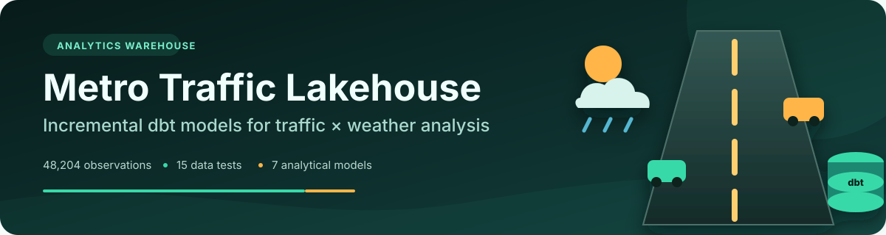
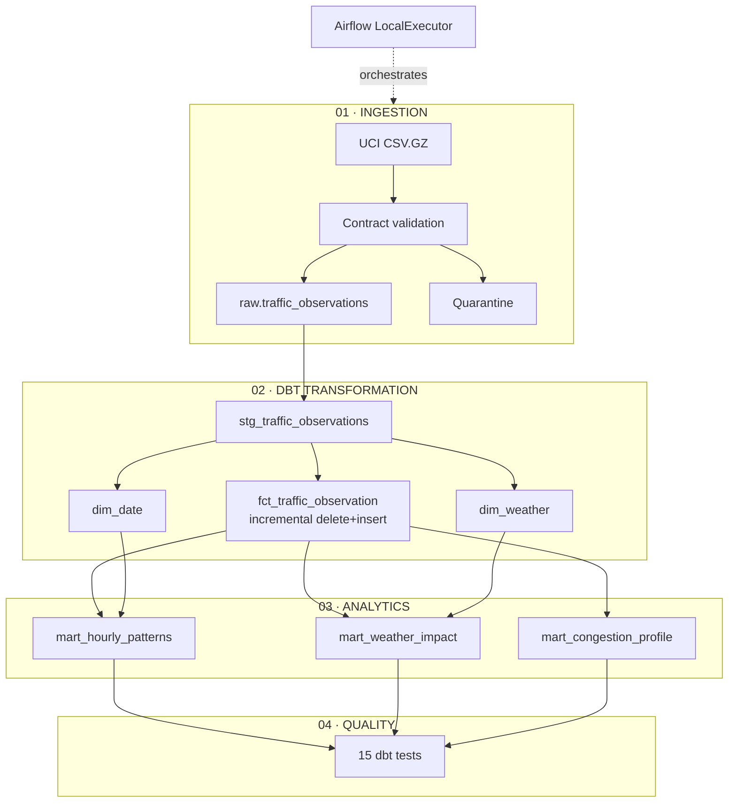
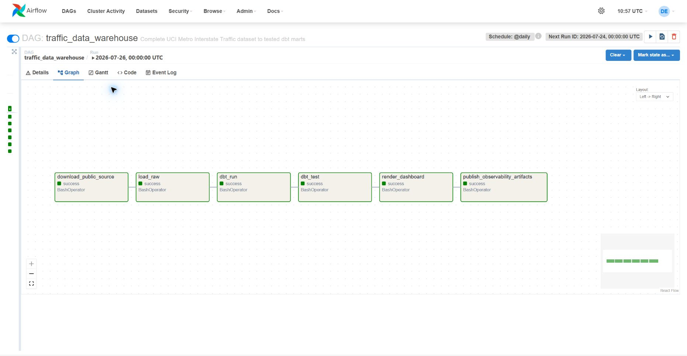
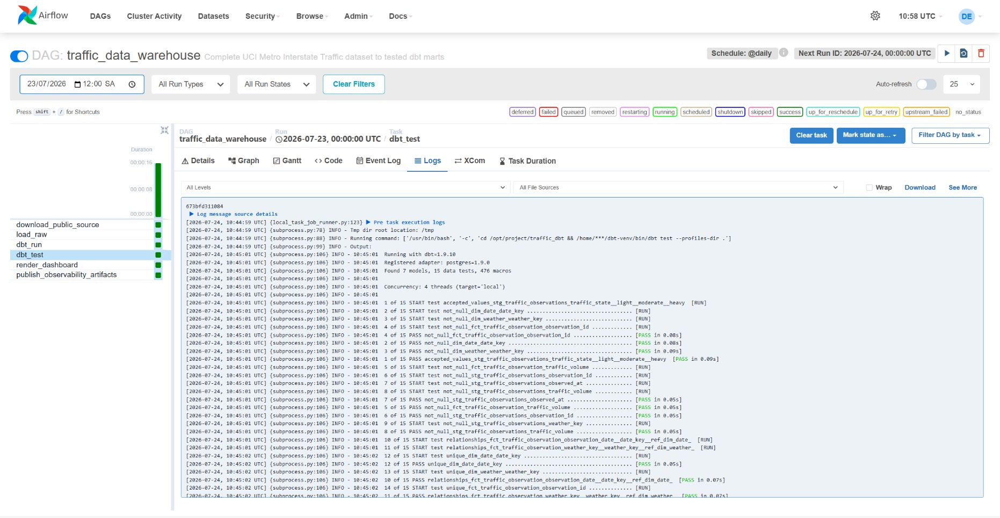
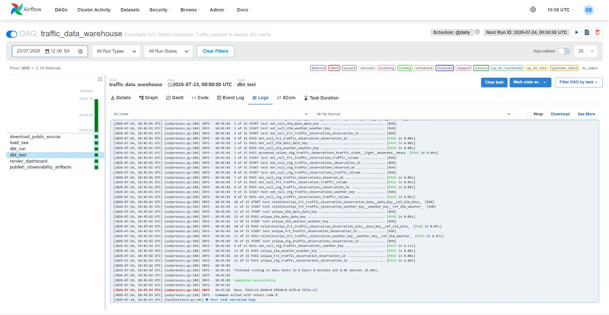
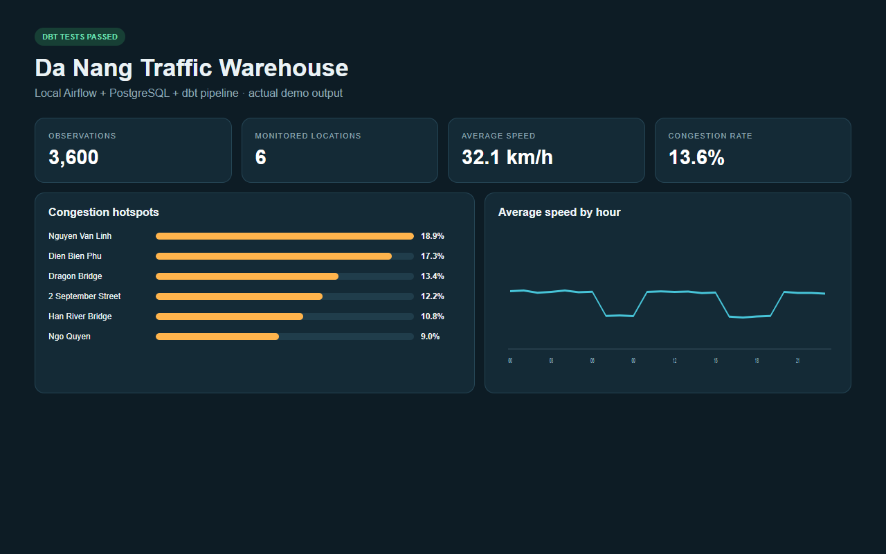

<p align="center">
  
</p>

<p align="center">
  <a href="https://github.com/npgb2505/traffic-data-warehouse-local/actions/workflows/ci.yml"></a>
  · <a href="README.vi.md">Tiếng Việt</a>
  · <a href="docs/architecture.excalidraw">Editable architecture</a>
</p>

# Metro Interstate Traffic Data Warehouse

This repository is a **warehouse and analytics engineering project**. Airflow owns ingestion; PostgreSQL holds the reproducible raw layer; dbt owns lineage, incremental transformations and testable analytical contracts. Traffic volume becomes useful only after it is joined to time and weather context.

## Lineage first



## dbt project map

```text
traffic_dbt/models
├── staging
│   └── stg_traffic_observations.sql
└── analytics
    ├── dim_date.sql
    ├── dim_weather.sql
    ├── fct_traffic_observation.sql      # incremental
    ├── mart_hourly_patterns.sql
    ├── mart_weather_impact.sql
    └── mart_congestion_profile.sql
```

## Tested analytical contract

| Layer | Contract |
|---|---|
| Raw | Valid timestamp, weather ranges, non-negative traffic volume |
| Staging | Unique observation ID, typed measures, derived traffic state |
| Dimensions | Unique and non-null date/weather keys |
| Fact | Referential integrity to both dimensions |
| Marts | Reproducible aggregations after incremental merges |

**Verified state:** 48,204 accepted observations · 0 rejected · coverage from 2012-10-02 to 2018-09-30 · 3,260 vehicles/hour average · 43.4% heavy-traffic observations.

## dbt test evidence

Unlike the other two projects, the central proof here is the transformation contract. These images come directly from the Airflow task that executed dbt 1.9.10.

### 1. DAG lineage completed

All six tasks are green, including `dbt_run` and `dbt_test`.



### 2. Individual dbt tests passed



### 3. Test suite closed with zero errors

`PASS=15 · WARN=0 · ERROR=0 · SKIP=0 · TOTAL=15 · return code 0`



## What the marts reveal

The artifact below is rendered from PostgreSQL marts—not reconstructed from the Airflow UI.



<details>
<summary><strong>Local operations</strong></summary>

### Start and load

```bash
make full
docker compose up -d airflow airflow-scheduler metabase
```

### Incremental and bounded backfill

```bash
make incremental
make backfill START="2018-01-01 00:00:00" END="2018-01-31 23:00:00"
```

### Validate

```bash
make test
docker compose run --rm airflow airflow dags test traffic_data_warehouse 2026-07-26
```

| Service | Address |
|---|---|
| Airflow | <http://localhost:8084> — `airflow / airflow` |
| PostgreSQL | `localhost:5544` — database/user/password: `traffic` |
| Metabase | <http://localhost:3004> |
</details>

## Data source

[UCI Machine Learning Repository — Metro Interstate Traffic Volume](https://archive.ics.uci.edu/dataset/492/metro+interstate+traffic+volume). Source data is downloaded at runtime and excluded from Git.
