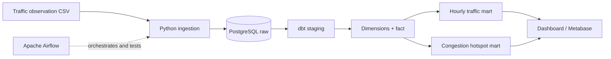
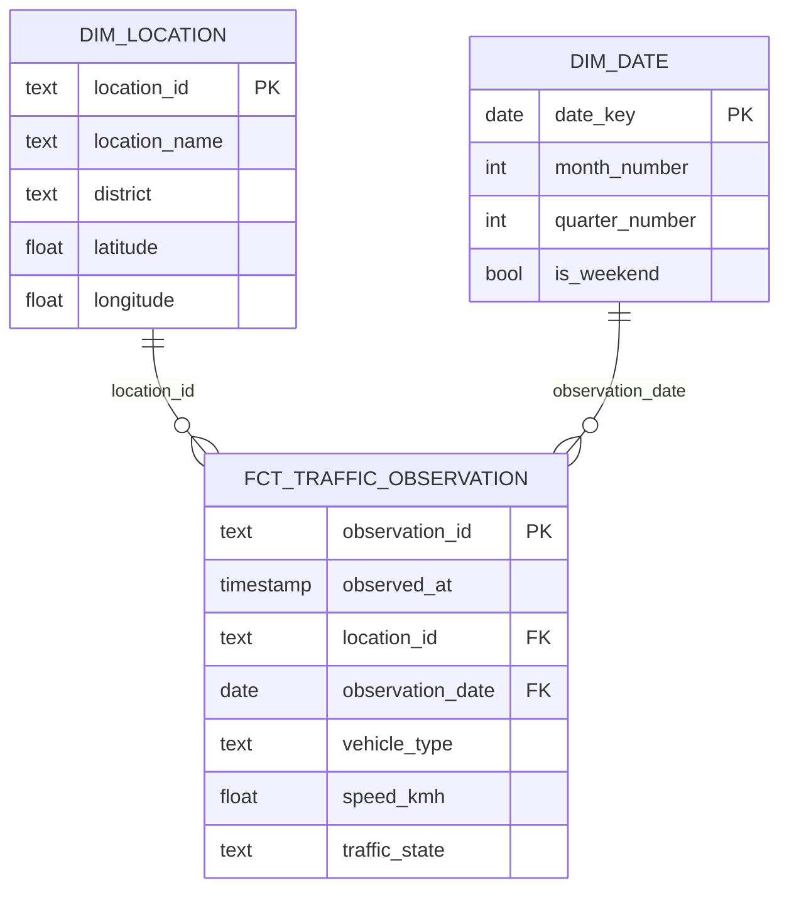

# Local Traffic Data Warehouse

[Bản tiếng Việt](README.vi.md)

A fully local analytical warehouse for urban traffic observations in Da Nang:

`Traffic CSV → PostgreSQL raw layer → dbt staging → dimensional model → tested analytics marts → dashboard`

Airflow orchestrates the workflow, dbt owns transformations and tests, and every service runs through Docker Compose without a paid cloud account.

## Architecture



## Data model



## Implemented features

- Deterministic 3,600-row traffic generator for six Da Nang locations.
- Fail-fast source quality gate and idempotent raw ingestion.
- dbt staging, dimensions, fact table and analytical marts.
- dbt uniqueness, null, accepted-value and relationship tests.
- Congestion classification and hotspot ranking.
- Airflow DAG with one task per observable pipeline stage.
- PostgreSQL, Airflow and Metabase in Docker Compose.
- Dashboard generated from actual dbt marts.

## Quick start

```bash
docker compose build
docker compose up -d warehouse
docker compose run --rm airflow python /opt/project/src/generate_data.py
docker compose run --rm airflow python /opt/project/src/load_raw.py
docker compose run --rm airflow bash -lc "cd /opt/project/traffic_dbt && dbt run --profiles-dir . && dbt test --profiles-dir ."
docker compose run --rm airflow python /opt/project/src/render_dashboard.py
```

Start the complete stack:

```bash
docker compose up -d
```

- Airflow: <http://localhost:8084>
- Metabase: <http://localhost:3004>
- PostgreSQL: `localhost:5544`, database/user/password: `traffic`

## Demo

These screenshots are generated from an actual local run after all dbt tests pass.

The verified run loaded 3,600 observations, built six dbt models and passed all 12 data tests. Airflow completed all five orchestration tasks successfully.


## Main marts

| Model | Purpose |
|---|---|
| `analytics.mart_hourly_traffic` | Speed and congestion by hour/location |
| `analytics.mart_congestion_hotspots` | Ranked monitored locations |
| `analytics.fct_traffic_observation` | Clean observation-grain fact |

## Verification

```bash
python -m pytest -q
cd traffic_dbt
dbt run --profiles-dir .
dbt test --profiles-dir .
```
