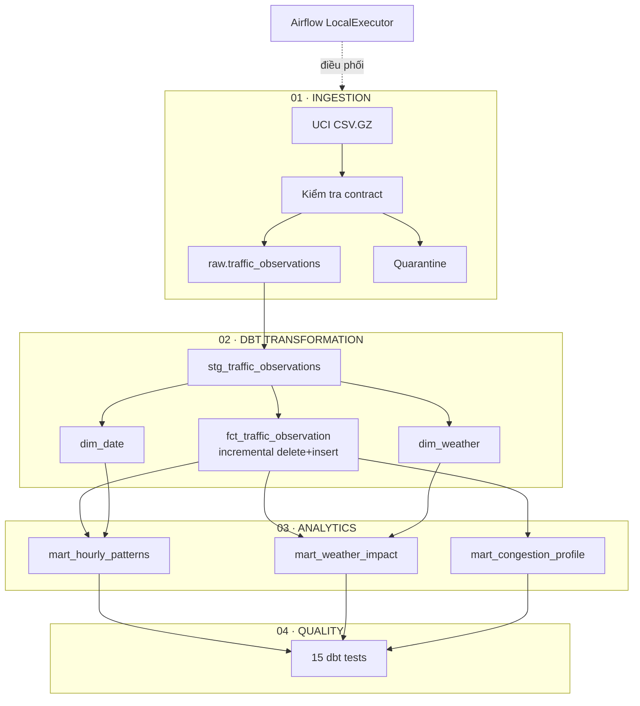

<p align="center">
  
</p>

<p align="center">
  <a href="https://github.com/npgb2505/traffic-data-warehouse-local/actions/workflows/ci.yml"></a>
  · <a href="README.md">English</a>
  · <a href="docs/architecture.excalidraw">Sơ đồ chỉnh sửa được</a>
</p>

# Kho dữ liệu giao thông Metro Interstate

Đây là dự án tập trung vào **warehouse và analytics engineering**. Airflow chịu trách nhiệm ingestion, PostgreSQL lưu raw layer có thể tái lập, còn dbt quản lý lineage, biến đổi incremental và hợp đồng phân tích có kiểm thử. Lưu lượng giao thông chỉ thực sự có ý nghĩa khi được đặt trong bối cảnh thời gian và thời tiết.

## Bắt đầu từ lineage



## Bản đồ dbt project

```text
traffic_dbt/models
├── staging
│   └── stg_traffic_observations.sql
└── analytics
    ├── dim_date.sql
    ├── dim_weather.sql
    ├── fct_traffic_observation.sql      # incremental
    ├── mart_hourly_patterns.sql
    ├── mart_weather_impact.sql
    └── mart_congestion_profile.sql
```

## Hợp đồng phân tích có kiểm thử

| Layer | Hợp đồng |
|---|---|
| Raw | Timestamp hợp lệ, miền thời tiết đúng, lưu lượng không âm |
| Staging | Observation ID duy nhất, measure đúng kiểu, traffic state được suy ra |
| Dimensions | Khóa ngày và thời tiết unique, not-null |
| Fact | Đảm bảo quan hệ khóa đến hai dimensions |
| Marts | Kết quả tổng hợp tái lập sau incremental merge |

**Trạng thái đã kiểm chứng:** 48.204 quan sát hợp lệ · 0 dòng bị loại · dữ liệu từ 02/10/2012 đến 30/09/2018 · trung bình 3.260 xe/giờ · 43,4% quan sát thuộc nhóm lưu lượng cao.

## Minh chứng kiểm thử dbt

Khác hai dự án còn lại, bằng chứng trung tâm ở đây là hợp đồng transformation. Các ảnh được chụp trực tiếp từ task Airflow chạy dbt 1.9.10.

### 1. Toàn bộ lineage hoàn thành

Cả sáu task đều xanh, bao gồm `dbt_run` và `dbt_test`.


### 2. Từng dbt test đều đạt


### 3. Test suite kết thúc không có lỗi

`PASS=15 · WARN=0 · ERROR=0 · SKIP=0 · TOTAL=15 · return code 0`


## Các mart cho biết điều gì?

Artifact dưới đây được dựng từ các mart PostgreSQL, không phải ảnh giao diện Airflow.


<details>
<summary><strong>Vận hành trên máy cá nhân</strong></summary>

### Khởi động và nạp full

```bash
make full
docker compose up -d airflow airflow-scheduler metabase
```

### Incremental và backfill có giới hạn

```bash
make incremental
make backfill START="2018-01-01 00:00:00" END="2018-01-31 23:00:00"
```

### Kiểm thử

```bash
make test
docker compose run --rm airflow airflow dags test traffic_data_warehouse 2026-07-26
```

| Dịch vụ | Địa chỉ |
|---|---|
| Airflow | <http://localhost:8084> — `airflow / airflow` |
| PostgreSQL | `localhost:5544` — database/user/password: `traffic` |
| Metabase | <http://localhost:3004> |
</details>

## Nguồn dữ liệu

[UCI Machine Learning Repository — Metro Interstate Traffic Volume](https://archive.ics.uci.edu/dataset/492/metro+interstate+traffic+volume). Dữ liệu được tải lúc chạy và không được commit.
