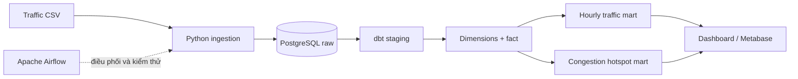

# Kho dữ liệu giao thông chạy local

[English README](README.md)

Kho dữ liệu phân tích quan sát giao thông tại Đà Nẵng:

`Traffic CSV → PostgreSQL raw → dbt staging → mô hình chiều → analytics marts → dashboard`

Airflow điều phối quy trình, dbt quản lý biến đổi và kiểm thử; toàn bộ dịch vụ chạy bằng Docker Compose, không cần cloud trả phí.

## Kiến trúc



## Đã triển khai

- Sinh 3.600 quan sát tái lập cho sáu địa điểm tại Đà Nẵng.
- Cổng chất lượng đầu vào và raw ingestion theo kiểu idempotent.
- dbt staging, dimension, fact và các mart phân tích.
- Kiểm thử dbt cho unique, null, tập giá trị và quan hệ khóa.
- Phân loại trạng thái giao thông và xếp hạng điểm ùn tắc.
- Airflow DAG tách riêng từng giai đoạn để dễ quan sát.
- PostgreSQL, Airflow và Metabase trong Docker Compose.
- Dashboard được sinh từ các mart dbt thật.

## Chạy nhanh

```bash
docker compose build
docker compose up -d warehouse
docker compose run --rm airflow python /opt/project/src/generate_data.py
docker compose run --rm airflow python /opt/project/src/load_raw.py
docker compose run --rm airflow bash -lc "cd /opt/project/traffic_dbt && dbt run --profiles-dir . && dbt test --profiles-dir ."
docker compose run --rm airflow python /opt/project/src/render_dashboard.py
docker compose up -d
```

- Airflow: <http://localhost:8084>
- Metabase: <http://localhost:3004>
- PostgreSQL: `localhost:5544`, database/user/password: `traffic`

## Demo đã kiểm chứng

Lần chạy thực tế nạp 3.600 quan sát, dựng sáu dbt models và vượt qua 12/12 data tests. Cả năm tác vụ Airflow đều hoàn tất thành công.


## Các mart chính

| Model | Mục đích |
|---|---|
| `analytics.mart_hourly_traffic` | Tốc độ và ùn tắc theo giờ/địa điểm |
| `analytics.mart_congestion_hotspots` | Xếp hạng điểm giao thông được giám sát |
| `analytics.fct_traffic_observation` | Fact quan sát đã làm sạch |

