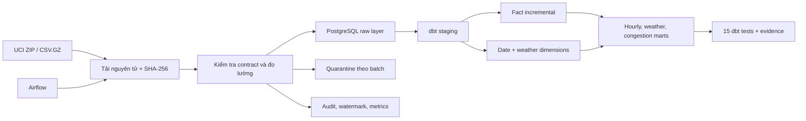

# Kho dữ liệu giao thông Metro Interstate

Dự án xây dựng kho dữ liệu hoàn chỉnh từ bộ **UCI Metro Interstate Traffic Volume**. Airflow tải và kiểm tra dữ liệu nguồn, PostgreSQL lưu raw layer có tính idempotent, còn dbt tạo và kiểm thử fact incremental, dimensions và các mart về lưu lượng–thời tiết.

> Chỉ cần Docker và dữ liệu công khai, không cần tài khoản cloud hay dịch vụ trả phí.

## Kết quả chạy toàn bộ dữ liệu

| Chỉ số | Kết quả |
|---|---:|
| Dòng nguồn / hợp lệ | 48.204 / 48.204 |
| Dòng bị loại | 0 |
| Khoảng thời gian | 02/10/2012–30/09/2018 |
| Lưu lượng trung bình | 3.260 xe/giờ |
| Tỷ lệ lưu lượng cao | 43,4% |
| Full dbt build | 22/22 model và test đạt |
| Raw incremental | 27 dòng |
| dbt incremental merge | 27 dòng |
| Dòng fact sau chạy lại | 48.204 |

## Kiến trúc



Bản Excalidraw có thể chỉnh sửa: [docs/architecture.excalidraw](docs/architecture.excalidraw)

## Điểm kỹ thuật chính

- Tải toàn bộ dữ liệu UCI, lưu checksum và manifest nguồn.
- Full refresh, incremental theo watermark từng giờ, lookback và backfill.
- Dùng PostgreSQL `COPY` vào staging tạm rồi upsert an toàn.
- Quality gate cho thời gian, thời tiết, nhiệt độ, mưa, tuyết, mây, lưu lượng và tính duy nhất.
- Fact dbt incremental theo chiến lược `delete+insert`.
- 15 dbt tests: unique, not-null, accepted values và quan hệ khóa.
- dbt nằm trong virtualenv riêng để không xung đột dependency với Airflow.
- Airflow tách metadata PostgreSQL, scheduler và webserver.

## Các model

`stg_traffic_observations`, `dim_date`, `dim_weather`, `fct_traffic_observation`, `mart_hourly_patterns`, `mart_weather_impact`, `mart_congestion_profile`.

## Cách chạy

```bash
make full
docker compose up -d airflow airflow-scheduler metabase
```

- Airflow: <http://localhost:8084> — `airflow` / `airflow`
- PostgreSQL: `localhost:5544` — database/user/password: `traffic`
- Metabase: <http://localhost:3004>

```bash
make incremental
make backfill START="2018-01-01 00:00:00" END="2018-01-31 23:00:00"
```

Nguồn: [UCI Metro Interstate Traffic Volume](https://archive.ics.uci.edu/dataset/492/metro+interstate+traffic+volume). Tệp dữ liệu được tải lúc chạy và không commit lên Git.
